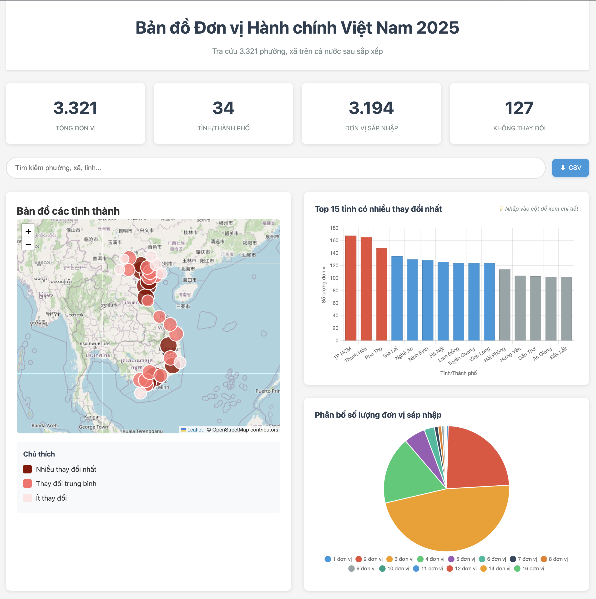

# Bản đồ Đơn vị Hành chính Việt Nam 2025

Interactive map and data visualization for Vietnam's 2025 administrative reorganization affecting 3,321 communes and wards across 34 provinces.

🌐 **Live Demo**: [https://vanducng.github.io/don-vi-hanh-chinh-2025/](https://vanducng.github.io/don-vi-hanh-chinh-2025/)

📊 **Data Source**: [VnExpress - Tra cứu 3.321 phường, xã trên cả nước sau sắp xếp](https://vnexpress.net/tra-cuu-3-321-phuong-xa-tren-ca-nuoc-sau-sap-xep-4903454.html)

## What You Can Do

🗺️ **Explore the Map** - Click on provinces to see detailed information about administrative changes in each region.

📊 **View Statistics** - Interactive charts show the top 15 provinces with the most changes and distribution of merger types.

🔍 **Search & Download** - Find specific communes or provinces, and download the complete dataset as CSV.

## Key Statistics

- **3,321** administrative units affected
- **34** provinces/cities involved
- **96.2%** of units underwent mergers
- **Top province**: TP HCM with 168 changes

## About the Data

This visualization presents data from VnExpress about Vietnam's 2025 administrative reorganization. The reform consolidated thousands of communes and wards across the country to improve governance efficiency.
